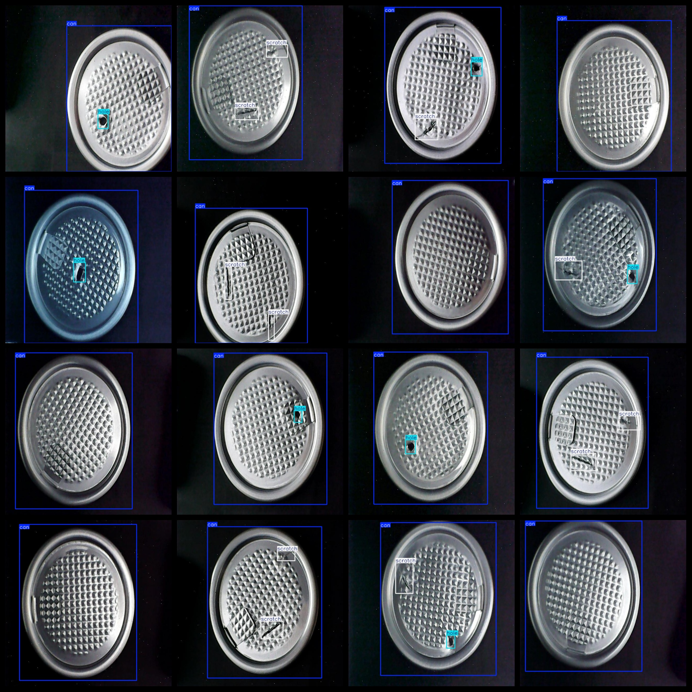

# Can Bottle Lid Defect Detection Dataset 854 images

Can Bottle Lid Defect Detection Dataset 854stretch

Dataset format: Pascal VOC format + YOLO format (the txt file does not contain the split path, it only contains jpg images and corresponding VOC format xml files and yolo format txt files)

Number of images (total number of jpg files): 854

Number of xml files: 854

Number of annotations (number of txt files): 854

Number of annotated categories: 3

The Github repository is: datasets_sl

Annotation class names: ["can","hole","scratch"]

Number of boxes labeled in each category:

The number of cans = 854

hole Frames = 374

Scratch Frame Count = 604

Total number of frames: 1832

Number of images per category:

Can occupancy of images = 854

Holes occupied by pictures = 374

"scratch" is an online interactive learning platform for children and young people. it does not provide information about the number of pictures that can be stored or owned.

Image resolution: 640x640

Use the labeling tool: labelImg

Dataset Augmentation: No

Rules for annotation: Draw a rectangle around the category.

Important note: The dataset does not have been divided into training, validation, and testing sets.

Special Disclaimer: This dataset does not guarantee the accuracy of the trained models or weight files.

Annotation and image details are as follows:

## Images

---

Here is a pay link on Stripe (https://buy.stripe.com/3cs8yP7sY87d0vu9AB). Please contact me lonlonago@foxmail.com after funding $89, and I will send you a complete data files, thank you!

